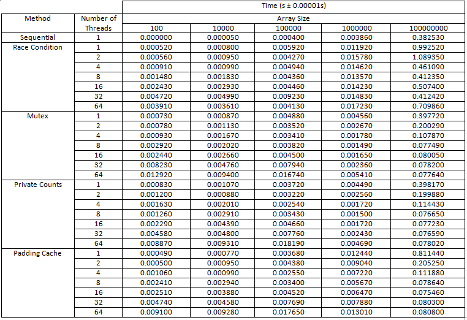
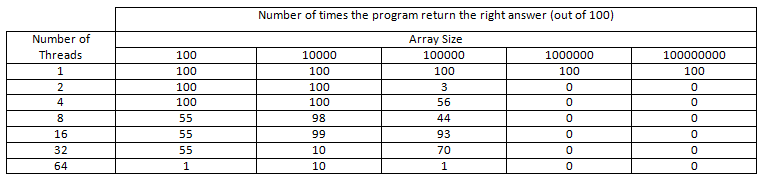

# Assignment 3

Tested on **Intel(R) Core(TM) i5-8250U CPU @ 1.60GHz**

## Report

### *<u>Introduction</u>*

This experiment aims to evaluate the performance of multithreaded programs with different input sizes and capture the effects of interleaving. The report will look at different implementations of, including an incorrect one with race conditions, mutexes, private variables, and resolved false sharing.

### *<u>Methodology</u>*

Each experiment (`sequential.c`, `count_race.c`, `count_private.c`, `count_cache.c`) was run 100 times. For each one the average run time was calculation, in addition to the number of correct values that the program with race conditions returns.

### *<u>Data Collection</u>*

<u>Table 1: Execution time for different number of threads on arrays of specified lengths </u>



<br/>

<u>Table 2: Number of correct results vs different number of threads </u>



<br/>

### *<u>Data Analysis and Conclusion</u>*

<br/>

Table 1 shows an increase in execution time in some cases and a decrease in others. For example, we can observe an increase in execution time for arrays of size 100 and 10000 which leads to thinking that multithreaded programs end up adding more work load for arrays of relatively smaller sizes instead of optimizing them.

On the other hand, for arrays of larger sizes we can observe a decrease in exection time for arrays of size 1000000 and 100000000, even though there are still fluctuations in the data. This might be caused by one of the control variables being broken, or possibly false sharing and cache pollution in the cases of `sequential.c`, `count_race.c`, `count_mutex.c`, and `count_private.c`.

In addition to this, there seems to be a slight improvement in performance in `count_cache.c` compared to the other experiments as a result of eliminating extra cache opeations and resolving false sharing.

Table 2 shows a decrease in the number of times the program returns the correct count as we increase the array size and the thread count. This is expected as higher thread counts cause more interleaving as they're all trying to modify a value at the same time, causing collisions. As a result the number of threads is inversely propertional to the number of correctly returned values.

<br/>

---

<br/>

## To compile

Windows: 

```
mingw32-make -f Makefile <recipe>
```

MacOS or Linux
```
make <recipe>
```

